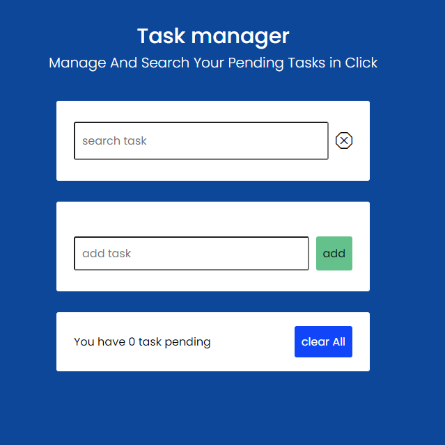

<h1 align="center">
  
  <br>
  To-Do List
</h1>

## 📗 Table of Contents

- [📖 To Do List](#-task-manager)
  - [🛠 Built With ](#-built-with-)
    - [Tech Stack ](#tech-stack-)
    - [Key Features ](#key-features-)
  - [🚀 Live Demo ](#-live-demo-)
  - [💻 Getting Started ](#-getting-started-)
  - [🤝 Contributing ](#-contributing-)
  - [⭐️ Show your support ](#️-show-your-support-)
  - [🙏 Acknowledgments ](#-acknowledgments-)


# 📖 Task manager 

A tool that helps to organize your day. Task manager list is a set of tasks that each render on a separate . you can add task  , deleted task , clear all task as well as search task in task manager .


## 🛠 Built With 

### Tech Stack 

I have built this project using the following tools & techniques:

- HTML
- CSS
- JavaScript

### Key Features 

- Add a new task
- Delete single task
- search task 
- clear task completed


## 🚀 Live Demo 

- [Live Demo Link](https://to-do-list-javascript-project-omkesh.netlify.app/)

## Getting Started

To get started with this project, follow these steps:

1. Clone the repository:

```bash
git clone https://github.com/omkeshborse/to-do-list.git
```

2. Open the project in your preferred code editor.

3. Launch the `index.html` file in a web browser to view the Netflix home page.

4. Feel free to modify the code and customize the page according to your preferences. You can update the content, change the colors, or add new features.

## 🤝 Contributing 

Contributions, issues, and feature requests are welcome! Feel free to check the [issues page](/issues).

## ⭐️ Show your support 

Give a ⭐️ if you like this project!

## Contact

If you have any questions, suggestions, or feedback, you can reach out to the project maintainer:

- Name : [omkesh borse](www.linkedin.com/in/omkeshborse)
- Email: [bomkesh25@gmail.com](mailto:keertidvcorai@gmail.com)


